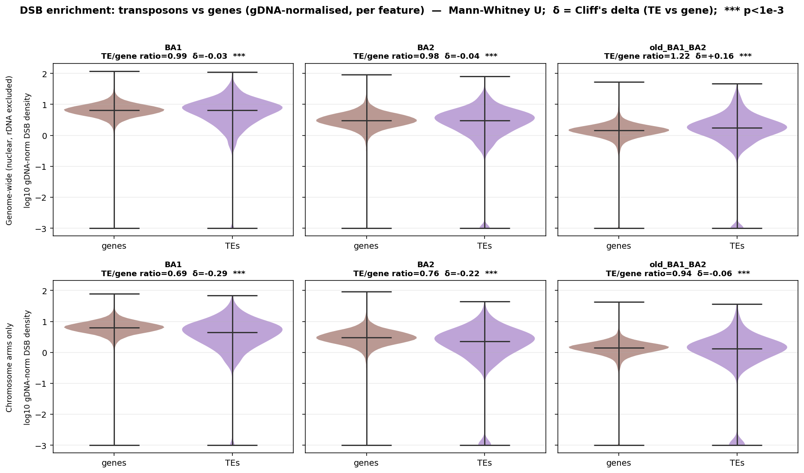
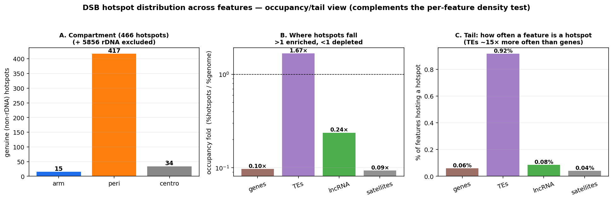
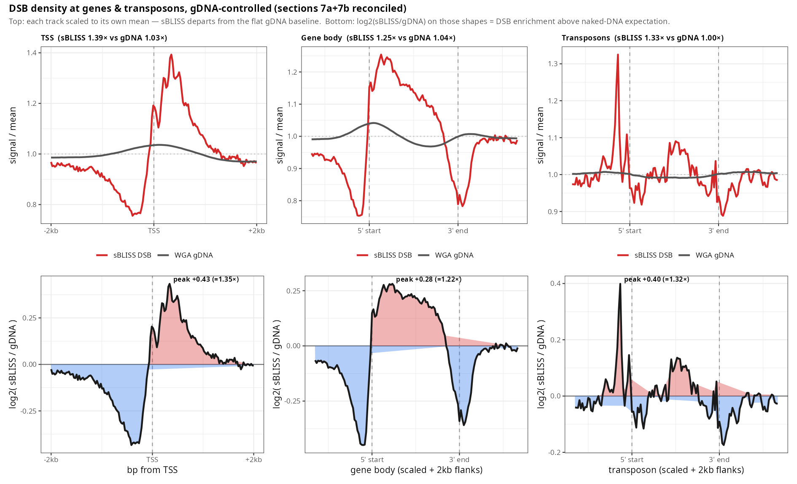

# sBLISS-seq — genome-wide DNA double-strand-break mapping in *Arabidopsis thaliana*

Snakemake pipeline and downstream analysis for mapping physiological DNA
double-strand breaks (DSBs) at single-nucleotide resolution from **in-suspension
BLISS sequencing (sBLISS)**, adapted from
[Hidmi et al. 2024 (STAR Protocols)](https://doi.org/10.1016/j.xpro.2024.103059)
for *Arabidopsis thaliana*. The primary analysis uses the **T2T, rDNA-resolved
Col-CC / TAIR12** assembly (`GCA_028009825.2`), with a WGA naked-DNA (gDNA)
control throughout to separate genuine DSB propensity from coverage/mappability
and copy-number artifacts.

> **License:** MIT · **Reports:** self-contained HTML in [`reports/`](reports/) ·
> **Data:** see [`DATA_AVAILABILITY.md`](DATA_AVAILABILITY.md)

---

## Pipeline (R1-only, single-end)

```
Raw FASTQ (R1)                       R2 = T7/backbone, discarded after demux
   │
   ├─ FastQC + MultiQC               raw read QC
   ├─ bliss_demux.py                 UMI = R1[:8]; Internal_Index = R1[8:16] (Hamming ≤ 1); strip 16 bp
   ├─ Trim Galore -q 20 --length 20  quality + RA3 adapter trimming
   ├─ HISAT2 / Bowtie2               DNA-mode alignment (Bowtie2 --very-sensitive -N1 for TAIR12)
   ├─ umi_tools dedup                PCR-duplicate removal (UMI + 5' position)
   ├─ 5' break extraction            5' end of each deduplicated read = exact DSB coordinate
   └─ bamCoverage (deepTools)        CPM-normalised bigWig (1 bp) for IGV
```

Barcodes: **BA1 = `CATCACGC`**, **BA2 = `GTCGTCGC`** (Internal_Index in R1[8:16]).
Full protocol, read structure, samples, and QC thresholds are in
[`pipeline/README.md`](pipeline/README.md).

### Quickstart

```bash
conda env create -f environment.yml
conda activate bliss

cp pipeline/config.example.yaml pipeline/config.yaml     # edit paths + samples
# (or config_TAIR12.example.yaml for the Col-CC / TAIR12 run)

snakemake --snakefile pipeline/Snakefile --directory pipeline \
          --configfile pipeline/config.yaml --cores 8
```

---

## Key findings

- **Chromosomal compartments (per uniquely-mapped read):** DSB propensity is
  **uniform across arms, pericentromere and centromere** — heterochromatin is *not*
  a cold spot. Its low per-Mb values are coverage/mappability (only ~2–4 % of the
  centromere/NOR is uniquely mappable at k=127).
- **The 45S rDNA is the one genuine, gDNA-confirmed DSB hotspot (~12–18×).**
  On the resolved TAIR12 assembly the WGA gDNA control sits ~flat across the NOR
  while sBLISS spikes ~8× by events → a real recombination/replication-fragility
  signal, not copy number. (It was unquantifiable on the collapsed ragtag assembly.)
- **RAD51 / RPA1A focally validate the arm hotspots** (MWU p≈0.002–0.003 at hotspots
  vs random), and arm hotspots are enriched for R-loops (ssDRIP) and G-quadruplexes —
  i.e. transcription/replication-stress-associated, HR-repaired breaks. WT γH2A.X is
  broad/diffuse and does **not** co-localise focally.
- **DSBs at feature ends (gDNA-controlled):** modest but real ~1.2–1.4× enrichment
  at TSS-proximal / 5′ gene-body / TE 5′ ends, above the naked-DNA baseline
  (see the reconciled metaplot below). **GO of high-DSB genes = nothing** — breaks
  track chromatin/location, not gene function.
- **Transposons are NOT DSB-enriched relative to genes** (new test, below).

---

## New in this release

### 1. Are transposons enriched for DSBs relative to genes? — a formal test

`analysis/te_vs_gene_enrichment.py` → [`results/tables/te_vs_gene_enrichment.csv`](results/tables/te_vs_gene_enrichment.csv),
[`figures/te_vs_gene_enrichment.png`](figures/te_vs_gene_enrichment.png)

Per-feature DSB density (breaks/kb), **divided by WGA gDNA** coverage over the same
feature, compared **gene vs TE** with a Mann–Whitney U test (effect size = Cliff's
δ; bootstrap CI on the median ratio). Stratified by compartment — genome-wide (rDNA
excluded), **chromosome arms only**, and **pericentromere only** — to separate
intrinsic feature effects from the compartment confound.



**Within a compartment (TE vs gene, ÷gDNA):**

| Compartment | BA1 (TE/gene) | BA2 (TE/gene) | Interpretation |
|-----------|:-------------:|:-------------:|----------------|
| Genome-wide (rDNA excl.) | **0.99** (δ −0.03) | **0.98** (δ −0.04) | per feature, TE ≈ gene — no enrichment |
| Chromosome arms only | **0.69** (δ −0.29) | **0.76** (δ −0.22) | TEs **depleted** vs genes (least-fragile features) |
| Pericentromere only | **0.99** (δ −0.03) | **0.94** (δ −0.08) | TE ≈ gene — both elevated |

**Across compartments (pericentromere ÷ arm, same feature class):**

| Feature | BA1 | BA2 | old | reading |
|--------|:---:|:---:|:---:|---------|
| TEs, peri/arm | **1.61×** | 1.42× | 1.43× | pericentromeric TEs much more break-dense than arm TEs |
| genes, peri/arm | 1.12× | 1.15× | 1.15× | pericentromeric genes barely change |

(TEs outnumber genes **2.4 : 1** in the pericentromere — 8,657 vs 3,622 — the reverse
of genome-wide.)

**Conclusion.** The widely-quoted "DSBs are enriched in TEs" is largely a
**compartment effect**, not an intrinsic property of transposons. Per feature (per
kb, ÷gDNA): genome-wide a TE is *no* more break-prone than a gene, and **on the arms
TEs are the *least*-fragile features** (0.69×). But the hypothesis that
**pericentromeres are fragile "because of" TEs is partly borne out**: the
pericentromeric DSB excess is carried **disproportionately by TEs** — a TE gains
~1.4–1.6× break density in the pericentromere vs the arm, while a gene gains only
~1.13× — and TEs make up the bulk of pericentromeric sequence. The driver, though, is
the **heterochromatic pericentromeric context** acting on that TE-rich DNA, not an
intrinsic per-element TE fragility (within the pericentromere, TEs are no more broken
than the genes beside them). (`old_BA1_BA2` is the low-complexity library; BA1/BA2 are
the reliable replicates.)

### 1b. How hotspots are distributed (occupancy/tail view)

`analysis/hotspot_distribution.py` → [`results/tables/hotspot_distribution.csv`](results/tables/hotspot_distribution.csv),
[`figures/hotspot_distribution.png`](figures/hotspot_distribution.png)

The density test (above) measures the *middle* of the distribution; hotspots are its
*upper tail*. Of the 466 genuine (non-rDNA) robust hotspots, ~90% are pericentromeric,
and by feature: **TEs occupancy-fold 1.67×** (enriched) vs **genes 0.10×** (depleted) —
and **0.92% of TEs host a hotspot vs only 0.06% of genes (~15×)**.



**Reconciliation with the density test:** a *typical* TE is no more break-prone than a
gene, but the *extreme* break sites fall overwhelmingly on a small subset of (mostly
pericentromeric) TEs. So "DSBs are enriched in TEs" is true of the **tail/occupancy**
(hotspot counts, breaks/Mb), not the **median** (per-feature density) — which is why
those metrics disagree.

### 2. Reconciled gene/TE metaplot (report §7a + §7b)

`analysis/metaplot_gene_te_reconciled.R` → [`figures/metaplot_gene_te_reconciled.png`](figures/metaplot_gene_te_reconciled.png)

The report previously split this into a `log2(BLISS/gDNA)` panel that "looked
modest/noisy" and a signal/mean overlay that "looked clearly enriched" — an
apparent contradiction. They are the **same signal**: both use the identical two
profiles and `log2(BLISS/gDNA) = log2(shapeBLISS/shapeGDNA) + const`. The old log2
*track* was noisy only because it divided a *sparse 5′-break* CPM by *dense
coverage* CPM with a `+1` pseudocount (unit mismatch, not weak biology). Computing
the ratio on the **mean-scaled shapes** removes that artifact and gives one honest
curve: DSBs are enriched **~1.2–1.4×** at TSS-proximal / 5′ feature ends above the
naked-DNA baseline. The report (§7) has been corrected accordingly.



---

## Reports

Self-contained HTML (all figures embedded) in [`reports/`](reports/):

| Report | Contents |
|--------|----------|
| **`sBLISS_TAIR12_report_with_CENH3ox.html`** | **primary** — full TAIR12 analysis + CENH3-OX comparison |
| `sBLISS_TAIR12_report.html` | full TAIR12 analysis |
| `sBLISS_CENH3ox_report.html` | standalone CENH3-overexpression comparison |
| `sBLISS_report_ragtag.html` | earlier Col-0 ragtag run (superseded by TAIR12) |

---

## Repository layout

```
pipeline/     Snakefile, run_pipeline.sh, config.example.yaml, envs/, scripts/ (core: bliss_demux, extract_dsb_sites)
analysis/     ~55 downstream R/Python/shell scripts (density, hotspots, enrichment, metaplots, satellite, external, reports)
reports/      self-contained HTML reports
results/
  regions/    region BEDs (centromere, pericentromere, arms, 45S/5S rDNA, CEN178, genes, TEs, lncRNA, satellites, G4, methylation)
  hotspots/   robust hotspot calls + annotations + taxonomy
  tables/     summary CSVs (compartment density, mappability, gDNA enrichment, te_vs_gene, …)
figures/      PNG/PDF figures
```

### Reproducibility & paths

The **core pipeline** (`pipeline/`) is config-driven and portable — copy an
`*.example.yaml`, set your paths, and run. The **downstream `analysis/` scripts are
kept verbatim** as they were run on this project and therefore contain
project-specific absolute paths. Most are parameterised by environment variables
(e.g. `BLISS_ROOT`, `BLISS_REGDIR`, `BLISS_BWDIR`, `BLISS_FIGDIR`, `BLISS_CHRSIZES`,
`BLISS_METADIR`) or by a `BASE=`/`P=` line at the top of the script — set those to
your paths before rerunning. See [`DATA_AVAILABILITY.md`](DATA_AVAILABILITY.md) for
where to obtain the raw reads, genomes, and external comparison datasets.

---

## Citation

Pipeline adapted from:
Hidmi O, Oster S, Shatleh D, Monin J, Aqeilan RI. *Protocol for mapping
physiological DSBs using in-suspension break labeling in situ and sequencing.*
STAR Protocols 5, 103059 (2024). https://doi.org/10.1016/j.xpro.2024.103059

Released under the [MIT License](LICENSE).
